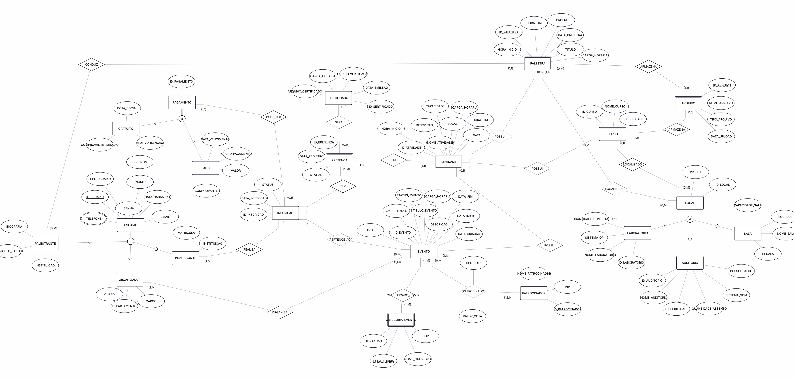
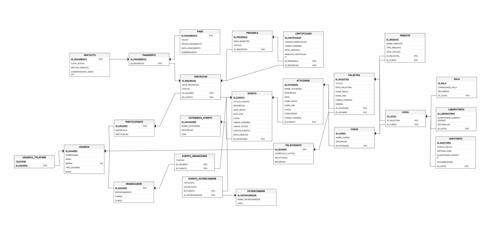

# Sistema Gerenciador de Eventos


## Sobre o Projeto
Projeto desenvolvida para a disciplina de Banco de Dados, voltada para a organização de eventos universitários. O sistema permite o gerenciamento completo de palestras, cursos, laboratórios e a inscrição de participantes, garantindo que o controle de vagas e horários seja feito sem conflitos.

O sistema gerencia todo o ciclo de vida dos eventos, incluindo:
* **Gestão de Pessoas:** Cadastro de organizadores, palestrantes e participantes.
* **Gestão de Eventos e Atividades:** Criação de eventos com categorização, cronogramas e atribuição de palestrantes.
* **Inscrições e Frequência:** Sistema de inscrição, controle de presença e emissão de certificados.
* **Gestão de Infraestrutura:** Controle de salas e auditórios, prevenindo conflitos de reserva.


## Modelagem do banco

* **Modelo Conceitual:** 
* **Modelo Lógico:** 

## Normalização
* **1FN (Primeira Forma Normal):** Atributos atômicos, como a separação da tabela `usuario_telefone`
* **2FN (Segunda Forma Normal):** Atributos não-chave dependem exclusivamente da chave primária
* **3FN (Terceira Forma Normal):** Remoção de dependências transitivas, isolando entidades como `local` e `categoria_evento`

## Funcionalidades Avançadas do Banco

### Procedures
* **`pr_registrar_participante_e_inscrever`**: Realiza o cadastro inicial na tabela de usuário (como Participante) e efetua a inscrição na atividade com status 'Pendente' em uma única transação, garantindo que o participante não fique "órfão" no sistema.
* **`pr_confirmar_pagamento`**: Verifica o status da inscrição e, caso não esteja confirmada, gera o registro financeiro (seja na modalidade paga ou gratuita/cota social), atualizando o status final da inscrição para 'Confirmada'.
* **`cadastrar_palestrante`**: Automatiza a criação de um usuário com o papel de 'Palestrante', vinculando imediatamente seu currículo Lattes, instituição e biografia na tabela específica de palestrantes.
* **`cancelar_inscricao`**: Altera o status de uma inscrição ativa para 'Cancelada' e atualiza o registro do comprovante de pagamento informando que o cancelamento partiu do usuário, liberando a vaga.
* **`encerrar_inscricoes_evento`**: Atualiza o status geral do evento para 'Inscrições encerradas' e cancela automaticamente todas as inscrições que ainda estavam com status 'Pendente' nas atividades vinculadas a ele.


### Triggers 
*   **`tg_antes_inscricao_horario`**: Bloqueia a inserção de uma nova inscrição se o participante já estiver inscrito em outra atividade com o mesmo horário (evita choque de agenda).
*   **`fn_verificar_capacidade_atividade`**: Verifica se o número de inscritos atingiu o limite da sala antes de efetivar uma nova inscrição. Se a sala estiver cheia, a trigger levanta uma exceção e interrompe o processo.

### Views 
* **`vw_ocupacao_atividades`**: Retorna uma visão consolidada de todas as atividades, exibindo a capacidade máxima, a contagem de vagas ocupadas (inscrições confirmadas) e o total de vagas restantes.
* **`view_cronograma_atividades`**: Facilita a consulta do cronograma geral, unindo informações de evento, categoria, tipo (curso ou palestra), local e horários, fornecendo a grade completa para os participantes.
* **`arrecadacao_evento`**: Agrupa dados financeiros por evento, mostrando a quantidade de inscrições pagas e o valor total arrecadado, simplificando a prestação de contas.
* **`perfil_de_usuario`**: Cria uma visão centralizada indicando o papel principal do usuário no sistema e sinalizadores (Sim/Não) para identificar rapidamente se ele atua simultaneamente como organizador, participante ou palestrante.
* **`engajamento_usuarios`**: Gera um relatório de métricas por usuário, calculando o total de inscrições realizadas, total de presenças confirmadas e a quantidade de certificados emitidos para ele.


## 🛠️ Como Rodar o Projeto

1. Crie o banco de dados `eventos` no PostgreSQL.

2. O sistema foi configurado para utilizar variáveis de ambiente por segurança. O arquivo `application.properties` está estruturado da seguinte forma:

```properties
spring.application.name=eventos

spring.datasource.url=jdbc:postgresql://localhost:5432/eventos
spring.datasource.username=${DB_USER:postgres}
spring.datasource.password=${DB_PASSWORD}

spring.jpa.show-sql=true
spring.jpa.properties.hibernate.format_sql=true
spring.jpa.hibernate.ddl-auto=none
```

3. Configure as variáveis de ambiente antes de executar a aplicação:

**PowerShell:**

```powershell
$env:DB_USER="seu_usuario"
$env:DB_PASSWORD="sua_senha"
```

### Execução

1. **Scripts:** Execute no DBeaver na seguinte ordem:

   ```
   criacao.sql → populacao.sql → triggers.sql → procedures.sql → views.sql
   ```

2. **Aplicação:**

   ```bash
   ./mvnw spring-boot:run
   ```

3. **Testes:**

   ```bash
   ./mvnw test
   ```

---

## 👥 Equipe

| Nome               | GitHub                                                         |
| :----------------- | :------------------------------------------------------------- |
| Lucas Albuquerque  | [@lucas-allb](https://github.com/lucas-allb)                   |
| Jamili Martins     | [@Jamili-Martins](https://github.com/Jamili-Martins)           |
| Natália Nascimento | [@nataliadsnascimento](https://github.com/nataliadsnascimento) |

